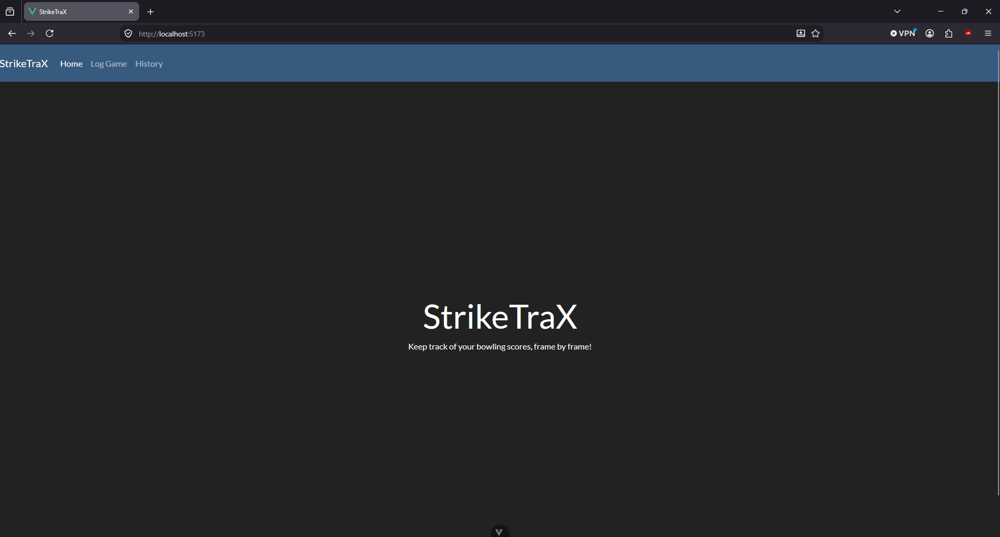
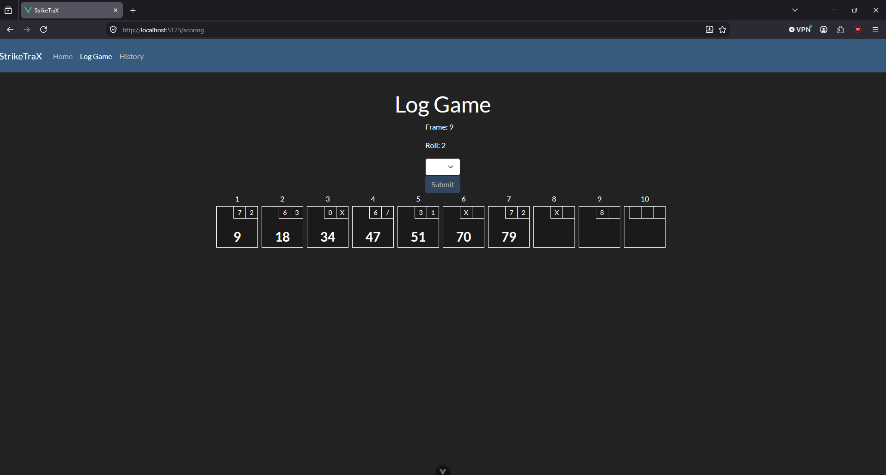
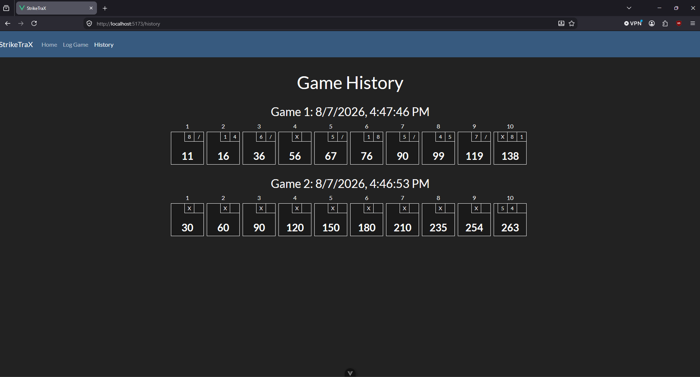

# StrikeTraX

StrikeTraX is a bowling score tracking web application that allows for live throw-by-throw updates, saving/loading in progress games, and displaying completed game history.





## Features

* Full, live, ten-pin scoring, including all 10th frame special cases
* Reactive display of current game state, including strikes, spares, rolling total, and current frame/roll
* Save/load for incomplete game
* Game history with persistence, including detection and recovery from corrupted or invalid save data
* Easy navigation through a nav bar and Vue Router
* Responsive, mobile-friendly layout

## Tech Stack

- [Vue 3](https://vuejs.org/) (Composition API)
- [Vite](https://vitejs.dev/)
- [Vue Router](https://router.vuejs.org/)
- [Bootstrap 5](https://getbootstrap.com/) via the [Bootswatch](https://bootswatch.com/) Darkly theme

## Getting Started

Clone the repository and install dependencies:

```sh
git clone https://github.com/zpangerl/StrikeTraX-Personal-Project.git
cd StrikeTraX-Personal-Project
npm install
```

Run the local dev server:

```sh
npm run dev
```

## Notable Design Decisions

* Decided to focus on basic functionality and UI first, leading to localStorage being used. Phase 2 of this project involves integrating a SQL database instead.
* History is currently unbounded, you could enter a hundred games, but given the current scale of the application I felt like pagination was fine to set aside for now.
* Currently, corrupted or invalid partial game data is simply discarded, this should be essentially impossible to do without directly messing with devtools, so this is fine for partial games.
* Corrupted completed games will currently result in a full wipe, since the next phase of this project involves adding a SQL database, this will be handled differently in the future.
* Invalid completed games will allow the user to remove just those games; per-game checking won't be needed when the database is integrated.

## Roadmap

Remaining phases to be completed:

### Phase 2

* Add an actual backend using Python/FastAPI, including POST/GET endpoints
* Add a SQL database using SQLAlchemy and Azure SQL
* Integrate basic anonymous session IDs as a placeholder for future login authentication
* Deploy to Azure

### Phase 3

* Sorting options on History page, oldest-newest, newest-oldest, high-low, low-high
* Date filtering on History page, pick two dates and see all games between them

### Phase 4

* Add login UI and remove placeholder anonymous session ID
* Use passlib/bcrypt to hash passwords and JWT tokens for sessions
* Update DB schema and POST/GET to use userID instead of anonymous session ID
